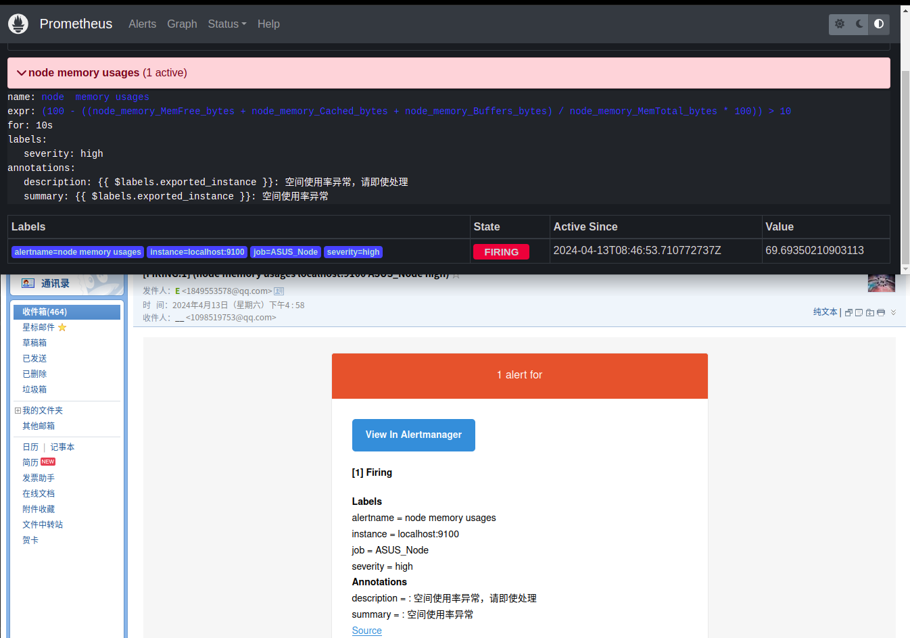

# ALERTING
Alerting with Prometheus is separated into two parts. Alerting rules in Prometheus servers send alerts to an Alertmanager. The Alertmanager then manages those alerts, including silencing, inhibition, aggregation and sending out notifications via methods such as email, on-call notification systems, and chat platforms.（Alerting 在Prometheus中被拆分为了两部分：1. 在Prometheus中定义报警规则以及发送告警信息到Altermanager;2. 由Alertmanager处理警告并发送警告。）

所以，配置Alerting的正确方式:
1. 启动并设置 Alertmanager
2. 配置Prometheus，与Alertmanager打通
3. 在Prometheus中配置告警规则

## 启动ALTER_MANAGER
```txt
   ./alertmanager --config.file=alertmanager.yml
```

## 展示
1. 
   - 具体配置查看 对应组件的配置