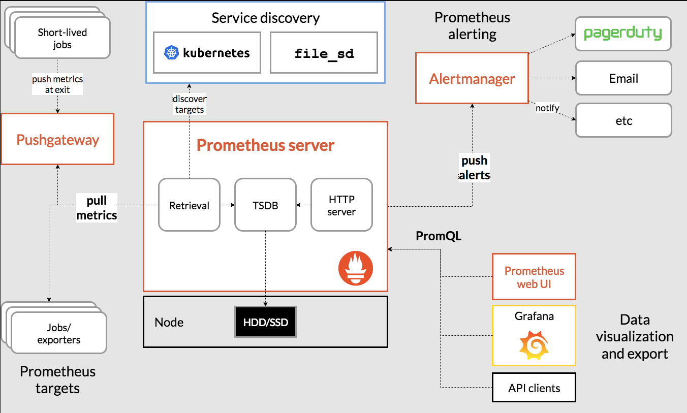

# Prometheus
```txt
    1. Prometheus是一个开源系统监控和警报工具包
    2. 适用于: 监控系统，收集系统运行数据，分析系统运行情况
    3. 不适用: 监控系统数据用于计费
```
## What is Prometheus?
Prometheus is an open-source systems monitoring and alerting toolkit originally built at SoundCloud. (Prometheus是一个开源系统监控和警报工具包，最初由SoundCloud构建。)  It is now a standalone open source project and maintained independently of any company.  To emphasize this, and to clarify the project's governance structure, Prometheus joined the Cloud Native Computing Foundation in 2016 as the second hosted project, after Kubernetes.(它现在是一个独立的开源项目，独立于任何公司进行维护。为了强调这一点，并澄清项目的治理结构，Prometheus于2016年加入了云原生计算基金会，成为继Kubernetes之后的第二个托管项目。)

Prometheus collects and stores its metrics as time series data, i.e. metrics information is stored with the timestamp at which it was recorded, alongside optional key-value pairs called labels.(普罗米修斯收集并存储其指标作为时间序列数据，即指标信息与记录时间戳一起存储，以及称为标签的可选键值对。)


## Features
### Prometheus`s main features are:
- a multi-dimensional data model with time series data identified by metric name and key/value pairs (一个多维数据模型，其时间序列数据由度量名称和键/值对标识)
- PromQL, a flexible query language to leverage this dimensionality （PromQL，一种灵活的查询语言，可以利用这个维度）
- no reliance on distributed storage; single server nodes are autonomous（不依赖分布式存储;单个服务器节点是自治的）
- time series collection happens via a pull model over HTTP (时间序列收集通过HTTP上的拉取模型进行)
- pushing time series is supported via an intermediary gateway(通过中间网关支持推送时间序列)
- targets are discovered via service discovery or static configuration (通过服务发现或静态配置发现目标)
- multiple modes of graphing and dashboarding support(多种模式的绘图和仪表板支持)

## What are metrics?
Metrics are numerical measurements in layperson terms. The term time series refers to the recording of changes over time. What users want to measure differs from application to application. For a web server, it could be request times; for a database, it could be the number of active connections or active queries, and so on.(在外行术语中，度量是数值测量。时间序列指的是随时间变化的记录。用户想要测量的内容因应用程序而异。对于web服务器，它可以是请求次数;对于数据库，它可以是活动连接或活动查询的数量，等等。)

Metrics play an important role in understanding why your application is working in a certain way. Let's assume you are running a web application and discover that it is slow. To learn what is happening with your application, you will need some information. For example, when the number of requests is high, the application may become slow. If you have the request count metric, you can determine the cause and increase the number of servers to handle the load.(指标在理解应用程序以某种方式工作的原因方面发挥着重要作用。让我们假设您正在运行一个web应用程序，并发现它很慢。要了解应用程序发生了什么，您需要一些信息。例如，当请求数量很高时，应用程序可能会变慢。如果您有请求计数指标，则可以确定原因并增加处理负载的服务器数量。)

## Components
The Prometheus ecosystem consists of multiple components, many of which are optional:（普罗米修斯生态系统由多个组件组成，其中许多是可选的:）
- the main Prometheus server which scrapes and stores time series data。（主要组件:Prometheus server:用于抓取和存储时间序列数据）
- client libraries for instrumenting application code (用于检测应用程序代码的客户端库)
- a push gateway for supporting short-lived jobs (支持短期作业的推送网关)
- special-purpose exporters for services like HAProxy, StatsD, Graphite, etc. (特殊用途的exporter service , 如 HAProxy, StatsD, Graphite 等)
- an alertmanager to handle alerts (一个alertmanager来处理告警)
- various support tools (各种支持工具)

## Architecture
This diagram illustrates the architecture of Prometheus and some of its ecosystem components:(这张图展示了普罗米修斯的架构及其生态系统的一些组成部分:)

Prometheus scrapes metrics from instrumented jobs, either directly or via an intermediary push gateway for short-lived jobs. It stores all scraped samples locally and runs rules over this data to either aggregate and record new time series from existing data or generate alerts. Grafana or other API consumers can be used to visualize the collected data.(Prometheus 从检测任务中<sup>图中的 jobs</sup>或直接从为短期任务提供的推送网关<sup>图中的 Pushgateway</sup>中获取指标，它将所有抓取的样本存储在本地，并对这些数据运行规则，以从现有数据中聚合和记录新的时间序列或生成警报。Grafana或其他API使用者可用于可视化收集的数据。)

## When does it fit?
Prometheus works well for recording any purely numeric time series. It fits both machine-centric monitoring as well as monitoring of highly dynamic service-oriented architectures. In a world of microservices, its support for multi-dimensional data collection and querying is a particular strength.(Prometheus可以很好地记录任何纯数字时间序列。它既适用于以机器为中心的监视，也适用于高度动态的面向服务的体系结构的监视。在微服务的世界中，它对多维数据收集和查询的支持具有独特的优势。)

Prometheus is designed for reliability, to be the system you go to during an outage to allow you to quickly diagnose problems. Each Prometheus server is standalone, not depending on network storage or other remote services. You can rely on it when other parts of your infrastructure are broken, and you do not need to setup extensive infrastructure to use it.(普罗米修斯是为可靠性而设计的，在停电期间，它可以让你快速诊断问题。每个Prometheus服务器都是独立的，不依赖于网络存储或其他远程服务。当您的基础设施的其他部分出现问题时，您可以依赖它，并且您不需要设置大量的基础设施来使用它。)

# When does it not fit?
Prometheus values reliability. You can always view what statistics are available about your system, even under failure conditions. If you need 100% accuracy, such as for per-request billing, Prometheus is not a good choice as the collected data will likely not be detailed and complete enough. In such a case you would be best off using some other system to collect and analyze the data for billing, and Prometheus for the rest of your monitoring.(普罗米修斯重视可靠性。您总是可以查看有关系统的可用统计信息，即使在故障条件下也是如此。如果您需要100%的准确性，例如每个请求的计费，那么Prometheus不是一个好的选择，因为收集的数据可能不够详细和完整。在这种情况下，您最好使用其他系统来收集和分析计费数据，使用Prometheus来完成其余的监控工作。)

## 参考资料
1. [https://prometheus.io/docs/introduction/overview/](https://prometheus.io/docs/introduction/overview/)

